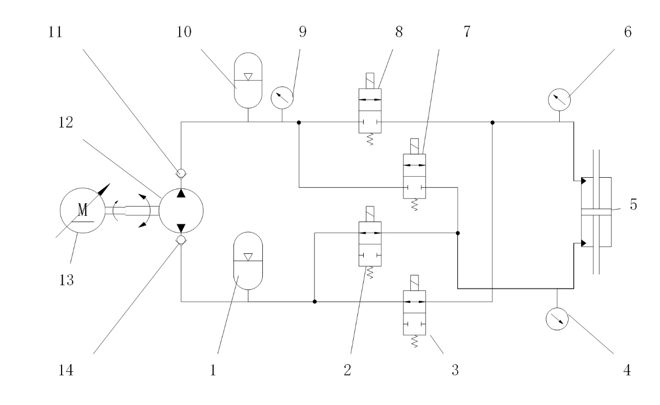

<h1 style="text-align:center">DSP调试记录</h1>

[TOC]


## 2022.03.06

​	测试dsp挂载五个mpu6050（实际挂载3个）的实际性能，mpu的读取频率为200HZ，采用分时复用的策略，实际读取中断的频率为1000HZ。

​	对控制逻辑的中断频率设置为200HZ和100HZ的情况进行测试，系统波特率为115200，控制中断中包括7个adc转换、一些乘除法运算和采集到的数据传输，实际发现如果需要传输完整的数据信息，200HZ完全不行，实际可能只有50HZ，同时发现自己写的uart_printf函数虽然方便，但是传输效率低，不如传统的直接发送。

​	然后将波特率强行提升至115200 * 10，在串口直连电脑时，200hz是可以的。使用蓝牙后，发现蓝牙无法设置1152000的波特率，然后降为460800（包括dsp），发现实际传输断断续续，估计可能是蓝牙不太行了，波特率有点高了。

​	优化方案：

	1. 优化传输数据的数据结构，减少整体的传输字节数。
	2. 将控制中断的频率降低为100HZ。
	3. 在进一步寻找蓝牙和dsp的波特率平衡点，比如 115200 * 2 或者 115200 * 3
## 2022.03.27

​	蹬腿极限 -121.99，平放约为 -135，收腿极限 -158.80。设平放角度为0，转换一下蹬腿极限为angle_zhi = 13，平放角度angle_ping = 0，收腿极限angle_bei  = -24

​	假肢回复的代码：

```c
if (arg < angle_zhi)
{
	PUSH();
    motor_run();
}
else
{
    motor_stop();
    MIDDLE();
}
```

​	假肢往复运动的代码：

```c
int flag = 1;
if(flag == 1)
{
    if(arg < angle_zhi - 1)
    {
        PUSH();
    }
    else
    {
        flag = 2;
    }
}
else if(flag == 2)
{
    if(arg > angle_bei + 1)
    {
        PULL();
    }
    else 
    {
        flag = 1;
    }
}
```

## 2022.03.31



|        | valve8 | valve7 | valve2 | valve3 |
| :----: | :----: | :----: | :----: | :----: |
| 卸荷态 |   ON   |   ON   |  OFF   |  OFF   |
| 被动态 |  OFF   |  OFF   |  OFF   |  OFF   |
|  蹬腿  |  OFF   |   ON   |   ON   |  OFF   |
|  收腿  |   ON   |  OFF   |  OFF   |   ON   |

(注意：其中ON代表通电，OFF代表断电)

​	实际假肢电路上设计的为，

​	pwm5 -> valve8, pwm4 -> valve2, pwm3 -> valve7, pwm2 -> valve3

​	对于被动态的阻尼实验，有被动跖曲和被动背曲，单阀控制阻尼主要控制出油口的开关阀，而我设计的实验主要是做被动背曲的。

|          | valve8 | valve7 | valve2 | valve3 |
| :------: | :----: | :----: | :----: | :----: |
| 被动背曲 |  OFF   |  OFF   |  PWM   |  OFF   |
| 被动跖曲 |  OFF   |  OFF   |  OFF   |  PWM   |

​	对应在假肢实际电路上，被动背曲控制pwm4，被动跖曲控制pwm2
