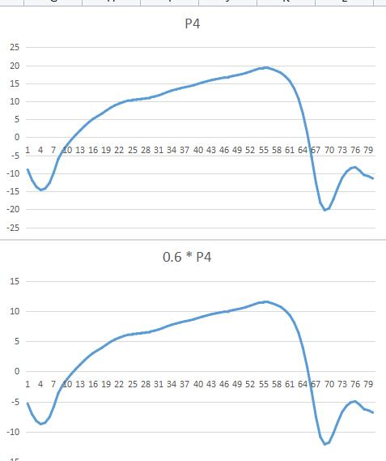

<h1 style="text-align:center">DSP调试记录</h1>

[TOC]


## 2022.03.06

​	测试dsp挂载五个mpu6050（实际挂载3个）的实际性能，mpu的读取频率为200HZ，采用分时复用的策略，实际读取中断的频率为1000HZ。

​	对控制逻辑的中断频率设置为200HZ和100HZ的情况进行测试，系统波特率为115200，控制中断中包括7个adc转换、一些乘除法运算和采集到的数据传输，实际发现如果需要传输完整的数据信息，200HZ完全不行，实际可能只有50HZ，同时发现自己写的uart_printf函数虽然方便，但是传输效率低，不如传统的直接发送。

​	然后将波特率强行提升至115200 * 10，在串口直连电脑时，200hz是可以的。使用蓝牙后，发现蓝牙无法设置1152000的波特率，然后降为460800（包括dsp），发现实际传输断断续续，估计可能是蓝牙不太行了，波特率有点高了。

​	优化方案：

	1. 优化传输数据的数据结构，减少整体的传输字节数。
	2. 将控制中断的频率降低为100HZ。
	3. 在进一步寻找蓝牙和dsp的波特率平衡点，比如 115200 * 2 或者 115200 * 3

## 2022.03.27

​	蹬腿极限 -121.99，平放约为 -135，收腿极限 -158.80。设平放角度为0，转换一下蹬腿极限为angle_zhi = 13，平放角度angle_ping = 0，收腿极限angle_bei  = -24

​	假肢回复的代码：

```c
if (arg < angle_zhi)
{
	PUSH();
    motor_run();
}
else
{
    motor_stop();
    MIDDLE();
}
```

​	假肢往复运动的代码：

```c
int flag = 1;
if(flag == 1)
{
    if(arg < angle_zhi - 1)
    {
        PUSH();
    }
    else
    {
        flag = 2;
    }
}
else if(flag == 2)
{
    if(arg > angle_bei + 1)
    {
        PULL();
    }
    else 
    {
        flag = 1;
    }
}
```


## 2022.03.31


|        | valve8 | valve7 | valve2 | valve3 |
| ------ | ------ | ------ | ------ | ------ |
| 卸荷态 | ON     | ON     | OFF    | OFF    |
| 被动态 | OFF    | OFF    | OFF    | OFF    |
| 蹬腿   | OFF    | ON     | ON     | OFF    |
| 收腿   | ON     | OFF    | OFF    | ON     |

(注意：其中ON代表通电，OFF代表断电)

 实际假肢电路上设计的为，

 pwm5 -> valve8, pwm4 -> valve2, pwm3 -> valve7, pwm2 -> valve3

 对于被动态的阻尼实验，有被动跖曲和被动背曲，单阀控制阻尼主要控制出油口的开关阀，而我设计的实验主要是做被动背曲的。

|          | valve8 | valve7 | valve2 | valve3 |
| -------- | ------ | ------ | ------ | ------ |
| 被动背曲 | OFF    | OFF    | PWM    | OFF    |
| 被动跖曲 | OFF    | OFF    | OFF    | PWM    |

 对应在假肢实际电路上，被动背曲控制pwm4，被动跖曲控制pwm2


## 2022.04.09


```c
// 单阀控制策略
void MIDDLE()
{
    // 被动跖屈控制EPWM2
    EPwm2Regs.CMPA.half.CMPA = valve_pwm_middle_zhi;
    EPwm3Regs.CMPA.half.CMPA = MIN_SPEED;
    // 被动背曲控制EPWM4
    EPwm4Regs.CMPA.half.CMPA = valve_pwm_middle_bei;
    EPwm5Regs.CMPA.half.CMPA = MIN_SPEED;
}

// 双阀控制策略
// valve_pwm_middle_zhi 代表 EPWM2 的占空比
// valve_pwm_middle_bei 代表 EPWM4 的占空比

#define PWM_linear_MAX	    0.8
#define PMW_linear_MIN	    0.15
#define PWM_MIDDLE_ZHI	    2
#define PWM_MIDDLE_BEI	    4
#define EPWM_TIMER_TBPRD    2000

int pwm2_timer_tbprd = 2000;
int pwm4_timer_tbprd = 2000;

void set_epwm_timer(int pwm_index, int pwm_timer_tbprd)
{
    if(pwm_index == 2)
    {
        EPwm2Regs.TBPRD = pwm_timer_tbprd;           // Set timer period TBCLKs
    }
    else if(pwm_index == 4)
    {
        EPwm4Regs.TBPRD = pwm_timer_tbprd;           // Set timer period TBCLKs
    }
}

void MIDDLE_zhi()
{
    if(valve_pwm_middle_zhi > PWM_linear_MAX)		// 高占空比非线性区
    {
        int pwm_tmp = (1 - PWM_linear_MAX) * (1 - valve_pwm_middle_zhi) * EPWM_TIMER_TBPRD;
        set_epwm_timer(PWM_MIDDLE_ZHI, pwm_tmp);
        valve_pwm_middle_bei = 0;

    }
    else if(valve_pwm_middle_zhi < PWM_linear_MIN)	// 低占空比非线性区
    {
        set_epwm_timer(PWM_MIDDLE_ZHI, EPWM_TIMER_TBPRD);
        valve_pwm_middle_bei = 0.8;
        valve_pwm_middle_zhi = PWM_linear_MIN + valve_pwm_middle_zhi;
    }
    else
    {
        set_epwm_timer(PWM_MIDDLE_ZHI, EPWM_TIMER_TBPRD);
        valve_pwm_middle_bei = 0;
    }
    EPwm2Regs.CMPA.half.CMPA = valve_pwm_middle_zhi;
    EPwm3Regs.CMPA.half.CMPA = MIN_SPEED;
    EPwm4Regs.CMPA.half.CMPA = valve_pwm_middle_bei;
    EPwm5Regs.CMPA.half.CMPA = MIN_SPEED;
}


void MIDDLE_bei()
{
    if(valve_pwm_middle_bei > PWM_linear_MAX)		// 高占空比非线性区
    {
        int pwm_tmp = (1 - PWM_linear_MAX) * (1 - valve_pwm_middle_bei) * EPWM_TIMER_TBPRD;
        set_epwm_timer(PWM_MIDDLE_BEI, pwm_tmp);
        valve_pwm_middle_zhi = 0;

    }
    else if(valve_pwm_middle_bei < PWM_linear_MIN)	// 低占空比非线性区
    {
        set_epwm_timer(PWM_MIDDLE_BEI, EPWM_TIMER_TBPRD);
        valve_pwm_middle_zhi = 0.8;
        valve_pwm_middle_bei = PWM_linear_MIN + valve_pwm_middle_bei;
    }
    else
    {
        set_epwm_timer(PWM_MIDDLE_BEI, EPWM_TIMER_TBPRD);
        valve_pwm_middle_zhi = 0;
    }
    EPwm2Regs.CMPA.half.CMPA = valve_pwm_middle_zhi;
    EPwm3Regs.CMPA.half.CMPA = MIN_SPEED;
    EPwm4Regs.CMPA.half.CMPA = valve_pwm_middle_bei;
    EPwm5Regs.CMPA.half.CMPA = MIN_SPEED;
}

```


## 2022.04.12

​	假肢的压力传感器的位置，其中P1的位置肯定对，P2和P3不清楚：


## 2022.09.06

​	蓝牙指令：

​	默认指令的格式为 55xx02xxxxffH

1. 550102xx00ff为基本状态设置，其中 00 - 卸荷+电机停止， 01 - 卸荷， 02 - 蹬腿， 03 - 被动， 04 - 收腿， 05 - 电机状态转变， 06 - 电机停止
2. 550202xx00ff为工作状态设置，其中 01 - 系统卸荷， 02 - 阻尼实验的被动态， 03 - 假肢状态回复, 04 - 假肢往复运动
3. 550302xxxxff为开关阀pwm设置，分别设置被动态下两个开关阀的开度


## 2022.09.08

​	液压压力传感器的调理电路中的滑动变阻器将电压缩小0.5倍，

​	足底压力传感器，1 -> A5，2 -> A6，3 -> A7

​	角度转换代码为`arg = 196.4 - arg`，测试收腿极限为 -12.32，测试蹬腿极限为 28.00


## 2022.09.09

​	角度转换代码为`arg = 196.4 - arg`，测试收腿极限为 -16.02，测试蹬腿极限为 20.02


## 2022.10.14

​	目前对于角度预测的逻辑存在一定的问题，如下图所示。




​	

​	可以看出来，被动跖曲很短，被动背曲太长了。我们选取的是红框中的为一个步态周期，但是我们理想的一个步态周期为摆动态的结束，而摆动态结束小腿角度不可能是0°。目前设置为5~12°左右，首先尝试5°，即开始和结束需要替换。


​	替换后，感觉效果也不是很好呀。